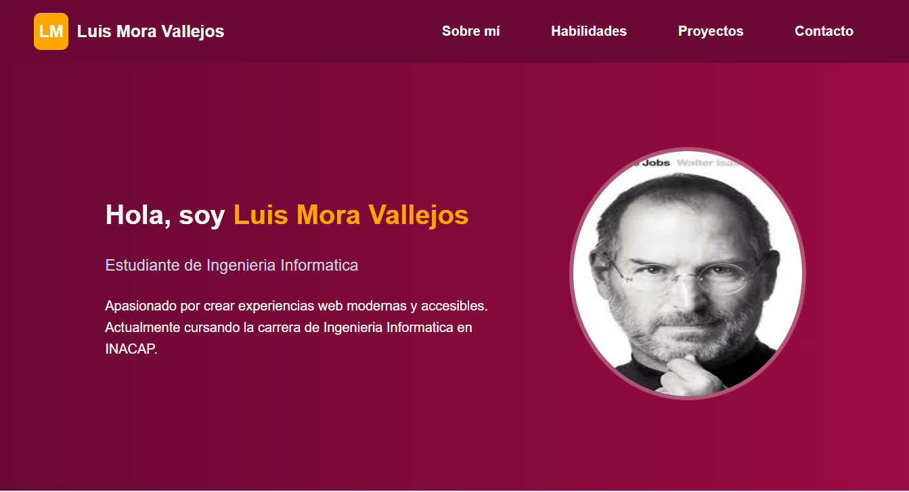
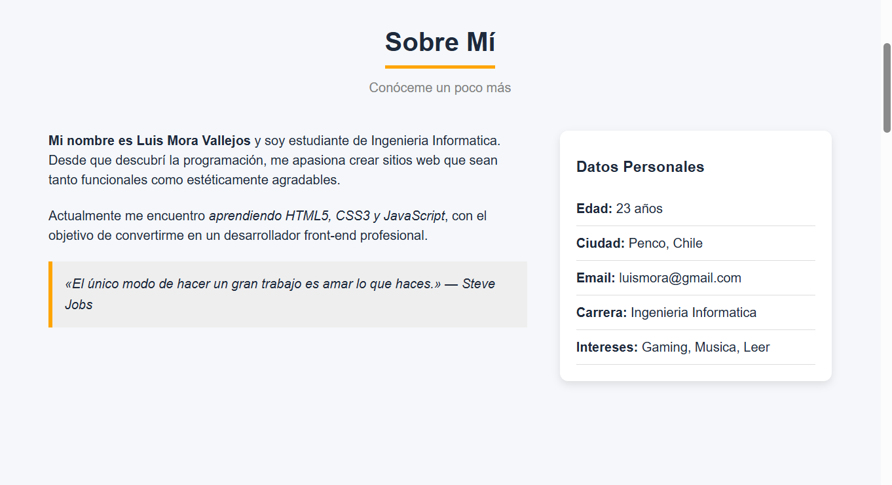
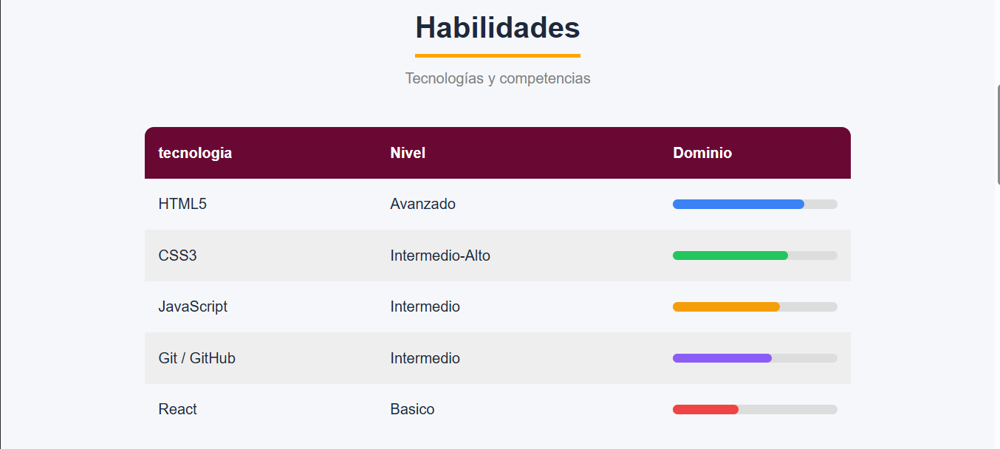
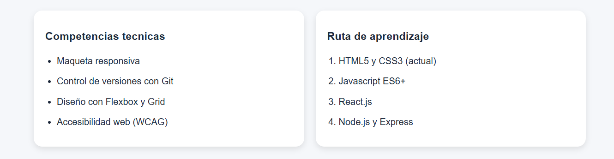
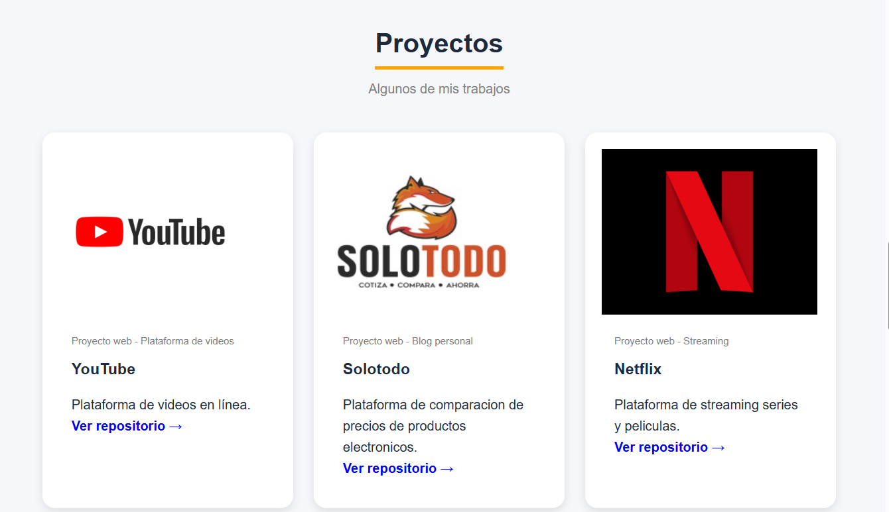
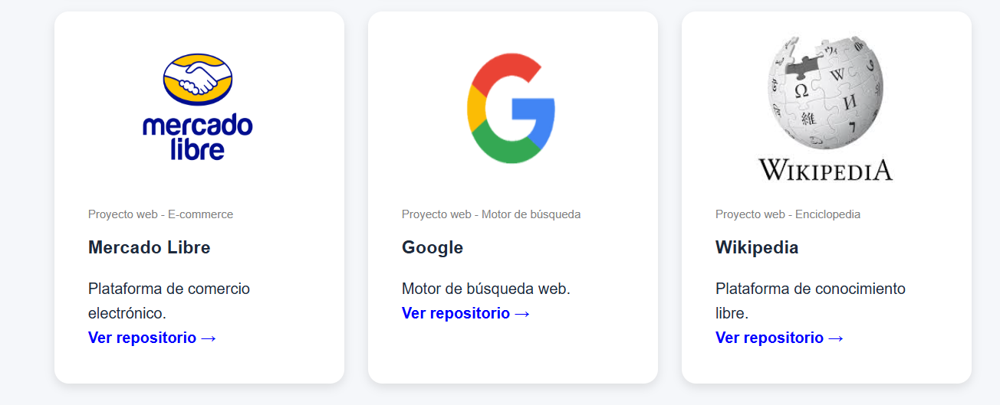
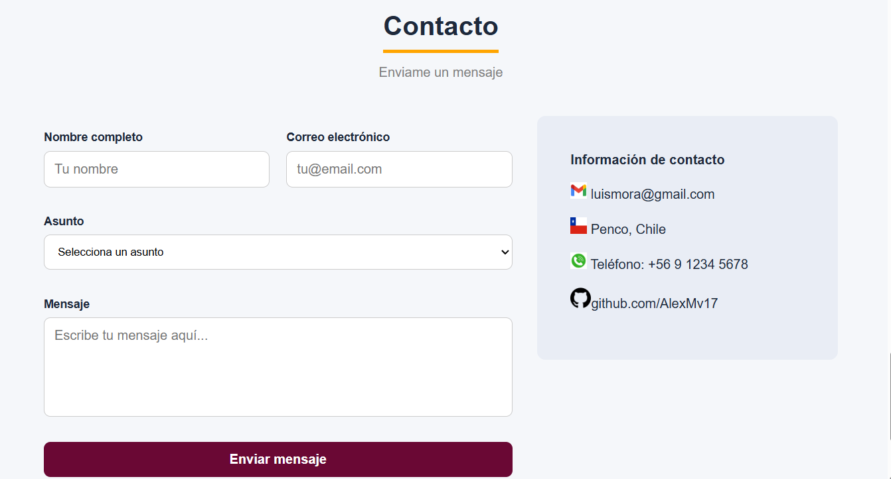

# Portafolio Web - Luis Mora Vallejos

Este proyecto corresponde al desarrollo de un **portafolio personal web**, creado con HTML y CSS, donde se presentan datos personales, habilidades, proyectos y un formulario de contacto.

---

## Descripción

El sitio web está diseñado como una página de presentación profesional que incluye múltiples secciones organizadas de forma semántica, permitiendo mostrar información relevante de manera clara y estructurada.

---

##  Tecnologías utilizadas

* HTML5 (estructura semántica)
* CSS3 (diseño y estilos)
* Flexbox y Grid (maquetación)
* Responsive Design (adaptación a dispositivos)

---

## Estructura del proyecto

```
/portafolio
│── index.html
│── estilos.css
│── README.md
│── /assets
│     ├── /screenshots
│     ├── /perfil
│     ├── /proyectos
│     └── /contacto
```

---

##  Secciones del sitio

### 🔹 Header

* Logo y nombre
* Menú de navegación

### 🔹 Sección principal

* Presentación personal
* Imagen de perfil

### 🔹 Sobre mí

* Información personal
* Uso de `<article>` y `<aside>`

### 🔹 Habilidades

* Tabla con niveles de dominio
* Barras de progreso
* Listas (`ul` y `ol`)

### 🔹 Proyectos

* Uso de `<figure>` y `<figcaption>`
* Enlaces a sitios externos

### 🔹 Contacto

Formulario con:

* `<form>`
* `<input>`
* `<select>`
* `<textarea>`

Información adicional de contacto

### 🔹 Footer

* Datos del autor
* Redes sociales
* Derechos reservados

---

##  Vista previa

### Inicio



### Sobre mí



### Habilidades




### Proyectos




### Contacto



---

##  Objetivo del proyecto

Aplicar conocimientos de desarrollo web básico utilizando HTML y CSS, incorporando:

* Etiquetas semánticas
* Buenas prácticas de estructura
* Diseño visual coherente

---

##  Autor

* **Luis Mora Vallejos**
* GitHub: https://github.com/AlexMv17

---

##  Licencia

Proyecto desarrollado con fines educativos.
